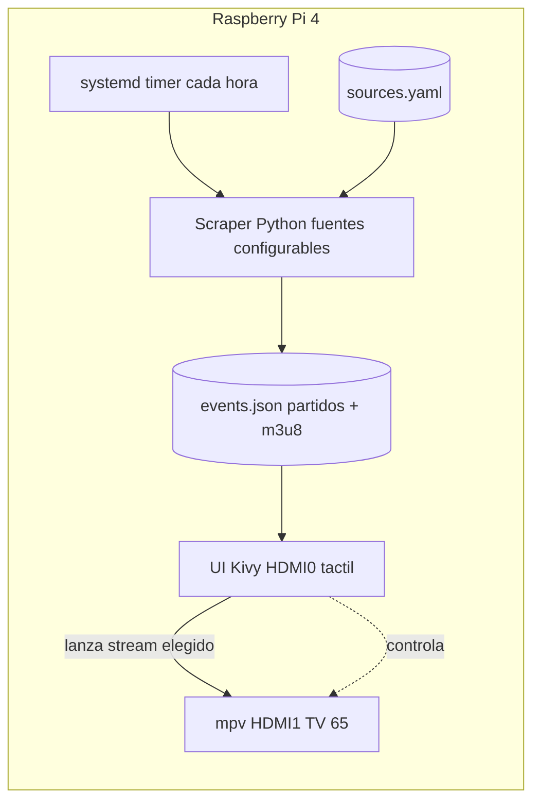

# Scrapper — Raspberry Pi Sports Kiosk

Dispositivo dedicado basado en **Raspberry Pi 4 (8 GB)** que, de forma automática y periódica, rastrea (scrapea) fuentes de streams deportivos, resuelve las URLs limpias de reproducción y muestra los partidos disponibles como **botones grandes en una pantalla táctil de 7"** (HDMI0). Al tocar un partido, el stream se reproduce a pantalla completa en una **TV de 65"** (HDMI1).

El enfoque inicial es la **NFL**, pero el sistema está diseñado para ser **genérico y extensible** a otras fuentes y deportes mediante configuración.

---

## Índice

- [Objetivo](#objetivo)
- [Aviso legal](#aviso-legal)
- [Hardware](#hardware)
- [Stack tecnológico](#stack-tecnológico)
- [Arquitectura](#arquitectura)
- [Estructura del repositorio](#estructura-del-repositorio)
- [Instalación y provisión](#instalación-y-provisión)
- [Configuración y formato de datos](#configuración-y-formato-de-datos)
- [Scraping](#scraping)
- [Interfaz y reproducción](#interfaz-y-reproducción)
- [Seguridad](#seguridad)
- [Roadmap](#roadmap)

---

## Objetivo

Convertir una Raspberry Pi 4 en un "sports kiosk" autónomo:

1. Cada hora, un proceso rastrea las fuentes configuradas y resuelve recursivamente los enlaces hasta obtener las URLs de stream limpias (típicamente manifiestos `.m3u8`/HLS).
2. Los partidos disponibles se guardan en un fichero JSON local (`events.json`).
3. La pantalla táctil de 7" (HDMI0) muestra una interfaz limpia con botones grandes, uno por partido disponible.
4. Al tocar un partido, el stream correspondiente se reproduce a pantalla completa en la TV de 65" (HDMI1).
5. El volumen se controla directamente desde la TV.

Al encender la Raspberry, arranca directamente en la interfaz (modo kiosk), sin escritorio ni distracciones.

---

## Aviso legal

Este proyecto es una **herramienta genérica de agregación y reproducción** de streams: no incluye, aloja ni distribuye contenido, y funciona con **cualquier fuente que el usuario configure** en `sources.yaml`.

Algunas fuentes populares (por ejemplo, agregadores tipo `fmhy.net`) enlazan a **retransmisiones no oficiales o no autorizadas**. El uso de este software para acceder a contenido con derechos de autor sin autorización puede ser **ilegal en tu jurisdicción**. Eres el único responsable de:

- Asegurarte de tener derecho a acceder al contenido que configures.
- Cumplir la legislación local sobre propiedad intelectual y las condiciones de uso de las fuentes.

Los autores del proyecto no se hacen responsables del uso que se le dé. Úsalo únicamente con fuentes y contenidos que estés autorizado a consumir.

---

## Hardware

| Componente        | Detalle                                             |
|-------------------|-----------------------------------------------------|
| Placa             | Raspberry Pi 4, 8 GB de RAM                          |
| Pantalla táctil   | 7" conectada a **HDMI0** (interfaz de selección)     |
| Televisión        | 65" conectada a **HDMI1** (reproducción del stream)  |
| Entrada           | Táctil en la pantalla de 7" (botones grandes)        |
| Audio / volumen   | Gestionado directamente por la TV                    |
| Red               | Ethernet/Wi-Fi (acceso remoto por SSH)               |

> La pantalla de 7" es táctil: sirve como panel de mando. La TV de 65" es solo salida de vídeo.

---

## Stack tecnológico

| Área                | Elección              | Motivo                                                                 |
|---------------------|-----------------------|------------------------------------------------------------------------|
| Sistema operativo   | Raspberry Pi OS Lite  | Base mínima + Xorg reducido para un arranque limpio en modo kiosk.     |
| Lenguaje            | Python 3              | Scraping y lógica de aplicación.                                       |
| Scraping estático   | `requests` + `BeautifulSoup` | HTML estático y navegación recursiva de enlaces.                |
| Scraping dinámico   | `Playwright`          | Páginas que requieren JavaScript para exponer el `.m3u8`.              |
| Interfaz táctil     | `Kivy` (MIT)          | Multitáctil nativo, botones grandes, funciona bien a pantalla completa en RPi. |
| Reproductor         | `mpv`                 | Reproducción robusta de HLS/`.m3u8` y salida dirigida a un monitor concreto. |
| Programación tareas | `systemd timer`       | Ejecuta el scraper cada hora de forma fiable.                          |
| Configuración       | `sources.yaml`        | Fuentes y deportes configurables sin tocar el código.                  |

---

## Arquitectura



Flujo resumido:

1. Un **systemd timer** dispara el **scraper** cada hora.
2. El scraper lee **`sources.yaml`**, navega recursivamente cada fuente hasta resolver las URLs limpias y escribe **`events.json`**.
3. La **UI Kivy** (HDMI0) lee `events.json` y pinta un botón grande por partido.
4. Al tocar un partido, la UI invoca al **reproductor mpv** dirigido a **HDMI1** (TV de 65").

### Componentes

1. **Scraper** (`scraper/`): lee `sources.yaml`, navega recursivamente hasta URLs limpias (`.m3u8`), normaliza y escribe `events.json`.
2. **UI Kivy** (`ui/`): lee `events.json`, muestra botones grandes por partido en HDMI0; al pulsar invoca al controlador de reproducción.
3. **Reproductor** (`player/`): wrapper de `mpv` que lanza el stream en HDMI1 y permite detener/cambiar de partido.
4. **Infra/setup** (`setup/`): scripts de provisión (actualizar la RPi, SSH por clave, sudo sin contraseña, Xorg mínimo, autostart kiosk, systemd timer).
5. **Configuración** (`config/`): `sources.yaml` y fichero de entorno (`.env`) ignorado por git.

---

## Estructura del repositorio

```text
scrapper/
├── README.md
├── config/
│   ├── sources.yaml        # Fuentes y deportes a rastrear (versionable)
│   └── .env.example        # Plantilla de variables de entorno (el .env real NO se versiona)
├── scraper/
│   ├── __init__.py
│   ├── main.py             # Punto de entrada: recorre fuentes y escribe events.json
│   ├── resolvers.py        # Navegación recursiva hasta el .m3u8 limpio
│   └── sources.py          # Carga y validación de sources.yaml
├── ui/
│   ├── __init__.py
│   ├── app.py              # App Kivy: grid de botones grandes (HDMI0)
│   └── kiosk.kv            # Layout/estilos de la interfaz táctil
├── player/
│   ├── __init__.py
│   └── mpv_player.py       # Wrapper de mpv dirigido a HDMI1
├── data/
│   └── events.json         # Salida del scraper (generado, ignorado por git)
├── setup/
│   ├── 01-update.sh        # Actualización del sistema
│   ├── 02-ssh-key.sh       # Acceso por clave SSH
│   ├── 03-sudo-nopasswd.sh # sudo sin contraseña para el usuario karlos
│   ├── 04-kiosk.sh         # Xorg mínimo + autostart de la UI en modo kiosk
│   └── scrapper.timer      # systemd timer (cada hora) + scrapper.service
└── requirements.txt
```

> `data/events.json` y `config/.env` se generan/definen en el dispositivo y **no** se versionan.

---

## Instalación y provisión

Datos de conexión de referencia (ajusta si cambian):

- **IP de la Raspberry Pi 4:** `10.10.0.246`
- **Usuario:** `karlos`

> Nunca guardes contraseñas en este repositorio. El acceso se hace **por clave SSH**.

### 1. Actualizar la Raspberry Pi

En la Raspberry (o vía SSH una vez conectado):

```bash
sudo apt update
sudo apt full-upgrade -y
sudo apt autoremove -y
sudo reboot
```

### 2. Acceso por clave SSH (alias `tvbox`)

Desde **tu equipo** (el que usarás para administrarla):

```bash
# 1) Genera una clave si aún no tienes una
ssh-keygen -t ed25519 -C "scrapper-admin"

# 2) Copia tu clave pública a la Raspberry (te pedirá la contraseña UNA vez)
ssh-copy-id karlos@10.10.0.246
```

Añade un alias cómodo en `~/.ssh/config` de tu equipo:

```ssh-config
Host tvbox
    HostName 10.10.0.246
    User karlos
    IdentityFile ~/.ssh/id_ed25519
```

A partir de aquí te conectas simplemente con:

```bash
ssh tvbox
```

(Opcional, recomendado) Una vez confirmado el acceso por clave, deshabilita el login por contraseña en la Raspberry editando `/etc/ssh/sshd_config`:

```text
PasswordAuthentication no
```

y reinicia el servicio:

```bash
sudo systemctl restart ssh
```

### 3. `sudo` sin contraseña para el usuario administrador

En la Raspberry, crea un fichero dedicado en `/etc/sudoers.d/` (usa `visudo` para evitar errores de sintaxis):

```bash
echo "karlos ALL=(ALL) NOPASSWD:ALL" | sudo tee /etc/sudoers.d/010_karlos-nopasswd
sudo chmod 0440 /etc/sudoers.d/010_karlos-nopasswd
# Verifica que la sintaxis es válida
sudo visudo -c
```

> Esto permite ejecutar `sudo` sin que pida contraseña. Es cómodo para un dispositivo dedicado en red local, pero **reduce la seguridad**: úsalo solo si entiendes la implicación.

### 4. Entorno mínimo y modo kiosk (interfaz limpia)

Instala solo lo necesario para lanzar la interfaz a pantalla completa sobre un Xorg reducido, más el reproductor y las dependencias de Python:

```bash
sudo apt install -y --no-install-recommends \
    xserver-xorg xinit x11-xserver-utils \
    mpv \
    python3 python3-pip python3-venv

# Dependencias de Python del proyecto
python3 -m venv ~/scrapper-venv
source ~/scrapper-venv/bin/activate
pip install -r requirements.txt
# Playwright necesita descargar su navegador:
python -m playwright install chromium
```

Arranque directo a la interfaz (kiosk) al encender: se lanza la app Kivy sobre `xinit` sin gestor de ventanas ni escritorio. El script `setup/04-kiosk.sh` deja preparado el autostart (por ejemplo, mediante un servicio de usuario o `~/.bash_profile` que ejecute `startx` con la app). Consulta [Interfaz y reproducción](#interfaz-y-reproducción).

### 5. Programar el scraper cada hora (systemd timer)

Instala la unidad de servicio y el timer (ver `setup/scrapper.timer`):

```bash
sudo cp setup/scrapper.service /etc/systemd/system/
sudo cp setup/scrapper.timer   /etc/systemd/system/
sudo systemctl daemon-reload
sudo systemctl enable --now scrapper.timer
# Comprobar cuándo se ejecutará la próxima vez
systemctl list-timers scrapper.timer
```

Ejemplo de `scrapper.timer`:

```ini
[Unit]
Description=Ejecuta el scraper de streams cada hora

[Timer]
OnCalendar=hourly
Persistent=true

[Install]
WantedBy=timers.target
```

---

## Configuración y formato de datos

### `config/sources.yaml`

Define **qué fuentes** rastrear, para **qué deportes/ligas** y con **qué estrategia** (HTML estático o navegador con JS). Añadir una fuente o un deporte nuevo es solo cuestión de editar este fichero.

```yaml
# Configuración global del scraper
settings:
  output: data/events.json      # Dónde se escribe el resultado
  request_timeout: 20           # Segundos por petición
  max_depth: 4                  # Profundidad máxima de navegación recursiva

sources:
  - name: fmhy-live-sports
    enabled: true
    url: "https://ejemplo.tld/video#live-sports"
    strategy: static            # static (requests+BeautifulSoup) | dynamic (Playwright)
    sports:                     # Deportes/ligas a conservar de esta fuente
      - nfl
    # Selectores/pistas para la navegación recursiva
    link_selector: "a.event-link"
    follow_pattern: ".*/live/.*"   # Solo sigue enlaces que casen con este patrón
    stream_pattern: "\\.m3u8"      # Se considera "limpio" cuando la URL casa con esto

  - name: ejemplo-dinamico
    enabled: false
    url: "https://otra-fuente.tld/deportes"
    strategy: dynamic           # Requiere JS: se usa Playwright
    sports:
      - nfl
      - nba
    wait_for: "video"           # Espera a que aparezca este elemento antes de extraer
    stream_pattern: "\\.m3u8"
```

Campos principales:

| Campo             | Descripción                                                                 |
|-------------------|-----------------------------------------------------------------------------|
| `name`            | Identificador único de la fuente.                                           |
| `enabled`         | Activa/desactiva la fuente sin borrarla.                                     |
| `url`             | Punto de entrada del rastreo.                                               |
| `strategy`        | `static` (HTML) o `dynamic` (Playwright, para páginas con JavaScript).      |
| `sports`          | Lista de deportes/ligas a conservar (p. ej. `nfl`, `nba`).                  |
| `link_selector`   | Selector CSS de los enlaces a seguir (estrategia `static`).                 |
| `follow_pattern`  | Regex: solo se siguen enlaces que casen con este patrón.                    |
| `stream_pattern`  | Regex que identifica una URL de stream "limpia" (fin de la recursión).      |
| `wait_for`        | (dynamic) Selector a esperar antes de extraer el stream.                    |

### `data/events.json`

Salida generada por el scraper. La UI lo lee para pintar los botones. Es un array de partidos:

```json
{
  "generated_at": "2026-09-13T18:00:00Z",
  "events": [
    {
      "id": "nfl-kc-vs-buf-20260913",
      "title": "Chiefs vs Bills",
      "league": "NFL",
      "sport": "nfl",
      "start_time": "2026-09-13T18:30:00Z",
      "stream_url": "https://cdn.ejemplo.tld/live/kc-buf/index.m3u8",
      "source": "fmhy-live-sports",
      "status": "live"
    },
    {
      "id": "nfl-dal-vs-phi-20260913",
      "title": "Cowboys vs Eagles",
      "league": "NFL",
      "sport": "nfl",
      "start_time": "2026-09-13T21:00:00Z",
      "stream_url": "https://cdn.ejemplo.tld/live/dal-phi/index.m3u8",
      "source": "fmhy-live-sports",
      "status": "upcoming"
    }
  ]
}
```

Campos de cada evento:

| Campo         | Descripción                                                      |
|---------------|------------------------------------------------------------------|
| `id`          | Identificador estable del partido (para evitar duplicados).      |
| `title`       | Texto mostrado en el botón grande.                               |
| `league`      | Liga legible (p. ej. `NFL`).                                     |
| `sport`       | Clave del deporte (coincide con `sources.yaml`).                 |
| `start_time`  | Hora de inicio en UTC (ISO 8601).                                |
| `stream_url`  | URL limpia lista para `mpv` (normalmente `.m3u8`).               |
| `source`      | Fuente de la que se obtuvo (para trazabilidad).                  |
| `status`      | `live`, `upcoming` o `ended`.                                    |

---

## Scraping

El scraper (`scraper/`) se ejecuta **cada hora** mediante un systemd timer y sigue este flujo:

1. **Carga** `config/sources.yaml` y filtra las fuentes con `enabled: true`.
2. Para cada fuente:
   - **`strategy: static`** → descarga el HTML con `requests` y lo parsea con `BeautifulSoup`.
   - **`strategy: dynamic`** → abre la página con `Playwright` (Chromium headless), espera a `wait_for` y captura el DOM/red ya renderizados por JavaScript.
3. **Navegación recursiva:** sigue los enlaces que casan con `follow_pattern`, hasta `max_depth`, buscando URLs que casen con `stream_pattern` (p. ej. `.m3u8`). Esas se consideran streams "limpios".
4. **Normalización:** cada partido se convierte al esquema de `events.json` (título, liga, deporte, hora, URL, estado), deduplicando por `id`.
5. **Escritura atómica:** se escribe a un fichero temporal y luego se renombra sobre `data/events.json`, de modo que la UI nunca lea un JSON a medio escribir.

### Logging y manejo de fallos

- **Logging** con el módulo `logging` de Python; salida capturada por `journald` (consultable con `journalctl -u scrapper.service`).
- **Fuente caída / timeout:** se registra el error y se **omite esa fuente**; el resto se procesa igualmente. Nunca se sobrescribe `events.json` con una lista vacía por un fallo puntual: si no se obtiene nada nuevo, se conserva la última salida válida.
- **Stream no resoluble:** si tras `max_depth` no se encuentra una URL que case con `stream_pattern`, ese candidato se descarta y se registra en el log.
- **Reintentos:** peticiones con timeout (`request_timeout`) y reintentos limitados para errores transitorios.

Ejecución manual para depurar:

```bash
source ~/scrapper-venv/bin/activate
python -m scraper.main --config config/sources.yaml --verbose
```

---

## Interfaz y reproducción

### Interfaz táctil (Kivy, HDMI0)

- App **Kivy** a pantalla completa en la pantalla de 7" (HDMI0).
- Muestra un **grid de botones grandes**, uno por partido de `events.json`, pensados para tocar con el dedo (texto amplio, alto contraste).
- **Refresco automático:** la UI vuelve a leer `events.json` periódicamente (o al detectar que el fichero cambió), de modo que tras cada ejecución horaria del scraper aparecen los partidos nuevos sin reiniciar la app.
- Estados visuales: los partidos `live` se resaltan; los `upcoming` muestran la hora de inicio.

### Reproductor (mpv, HDMI1)

Al tocar un partido, la UI llama al wrapper de `player/mpv_player.py`, que lanza `mpv` dirigido a la **segunda pantalla** (HDMI1, la TV de 65"):

```bash
mpv --fullscreen --fs-screen=1 --screen=1 \
    --force-window=yes --no-terminal \
    "https://cdn.ejemplo.tld/live/kc-buf/index.m3u8"
```

- `--fs-screen=1` / `--screen=1`: fija la salida en HDMI1 (la numeración `0`/`1` puede variar según el orden de detección; se ajusta en la configuración del reproductor).
- Al elegir otro partido, la UI **detiene** la instancia actual de `mpv` y lanza el nuevo stream.
- **Volumen:** se controla directamente desde la TV, tal y como se pidió (mpv no gestiona el volumen).

### Arranque en modo kiosk

Al encender la Raspberry:

1. Arranca en consola (Raspberry Pi OS Lite, sin escritorio).
2. Se lanza `startx` con la app Kivy como único cliente X (sin gestor de ventanas), ocupando toda la pantalla de 7".
3. La interfaz queda lista para tocar; HDMI1 permanece en espera hasta que se elige un partido.

Flujo de usuario: **encender → ver la lista de partidos en la pantalla de 7" → tocar un partido → verlo en la TV de 65"**.

---

## Seguridad

- **Sin contraseñas en el repositorio.** El acceso es por **clave SSH** (ver [Instalación y provisión](#instalación-y-provisión)).
- Las credenciales o tokens necesarios en tiempo de ejecución van en `config/.env` (ignorado por git); usa `config/.env.example` como plantilla.
- Considera deshabilitar `PasswordAuthentication` en SSH una vez validado el acceso por clave.
- `sudo` sin contraseña es cómodo pero reduce la seguridad: actívalo solo en una red de confianza y siendo consciente del riesgo.
- (Opcional) Filesystem raíz de solo lectura (overlay) para mayor robustez ante cortes de energía en un dispositivo siempre encendido.

---

## Roadmap

Mapeo de las tareas originales a esta arquitectura:

- [ ] **1. Actualizar la Raspberry** — `setup/01-update.sh` (`apt update && full-upgrade`).
- [ ] **2. Acceso fácil por SSH** — alias `tvbox` + `ssh-copy-id` (`setup/02-ssh-key.sh`).
- [ ] **3. `sudo` sin contraseña** — `/etc/sudoers.d/` (`setup/03-sudo-nopasswd.sh`).
- [ ] **4. Instalación limpia / kiosk** — Xorg mínimo + autostart de la UI (`setup/04-kiosk.sh`).
- [ ] **5. Rutinas de scraping cada hora** — `scraper/` + systemd timer (`setup/scrapper.timer`).

Trabajo de implementación pendiente:

- [ ] Implementar el scraper (`scraper/main.py`, `resolvers.py`, `sources.py`).
- [ ] Implementar la UI Kivy (`ui/app.py`, `ui/kiosk.kv`) con refresco automático.
- [ ] Implementar el wrapper de `mpv` (`player/mpv_player.py`) con selección de HDMI1.
- [ ] Escribir los scripts de `setup/` y las unidades systemd.
- [ ] Definir `config/sources.yaml` real y `config/.env.example`.
- [ ] Pruebas end-to-end en el dispositivo (dual-HDMI, táctil, timer horario).

Ideas futuras:

- Panel de estado/salud (última ejecución del scraper, nº de partidos, errores).
- Soporte para más deportes/ligas y más fuentes en paralelo.
- Reconexión automática del stream si se corta.
# scrapper
